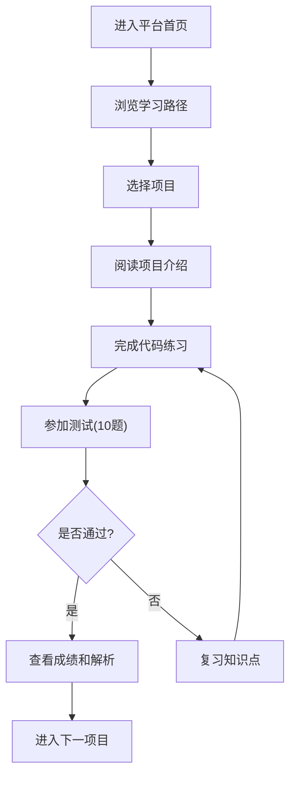

# 数据分析实战训练营 - 产品需求文档

## 1. 产品概述

一个面向零基础学习者的数据分析在线学习平台，通过10个实战项目帮助用户掌握从数据清洗到机器学习的完整数据分析技能。平台新增代码练习编辑器和完善的测试系统，每个项目包含10道测试题，满分100分。

- 目标用户：零基础学生、职场入门者、数据分析爱好者
- 核心价值：真实数据集 + 代码实操 + 测评闭环的学习体验

## 2. 核心功能

### 2.1 用户角色

| 角色 | 注册方式 | 核心权限 |
|------|----------|----------|
| 学员 | 邮箱注册/游客模式 | 浏览课程、完成练习、参加测试、查看学习进度 |

### 2.2 功能模块

1. **首页**: 课程介绍、学习路径、项目中心入口
2. **项目详情页**: 项目介绍、代码练习编辑器、知识点梳理
3. **测试页面**: 10道测试题、计时功能、成绩评定
4. **学习资源页**: 数据集下载、代码模板、知识点文档

### 2.3 页面详情

| 页面名称 | 模块名称 | 功能描述 |
|----------|----------|----------|
| 首页 | Hero区域 | 课程标题、简介、学习进度展示 |
| 首页 | 学习路径 | 4个学习阶段的可视化展示 |
| 首页 | 项目中心 | 10个项目卡片，显示完成状态 |
| 项目详情页 | 项目介绍 | 核心任务、使用数据、学习目标 |
| 项目详情页 | 代码练习编辑器 | 在线代码编辑、运行、结果展示 |
| 项目详情页 | 知识点梳理 | 核心技能点、易错点总结 |
| 测试页面 | 测试题区域 | 10道选择题、进度条、计时器 |
| 测试页面 | 成绩展示 | 得分、正确率、答案解析 |
| 学习资源页 | 数据集资源 | 4个数据集的下载和字段说明 |
| 学习资源页 | 代码模板 | 可复用的代码模板展示 |
| 学习资源页 | 知识点文档 | 分类知识点手册 |

## 3. 核心流程

### 3.1 学习流程

用户进入平台 → 浏览学习路径 → 选择项目 → 阅读项目介绍 → 完成代码练习 → 参加测试 → 查看成绩和解析 → 进入下一项目

### 3.2 流程图

## 4. 用户界面设计

### 4.1 设计风格

- **主色调**: 深蓝色 (#1a365d) + 橙色强调 (#ed8936)
- **辅助色**: 浅灰背景 (#f7fafc)、白色卡片、绿色成功状态 (#48bb78)
- **按钮风格**: 圆角矩形，带有微妙阴影，hover时有轻微上浮效果
- **字体**: 标题使用思源黑体/Source Han Sans，代码使用 JetBrains Mono
- **布局风格**: 卡片式布局，顶部导航，左侧项目列表
- **图标风格**: 线性图标，统一2px线宽

### 4.2 页面设计概览

| 页面名称 | 模块名称 | UI元素 |
|----------|----------|--------|
| 首页 | Hero区域 | 渐变背景、大标题、进度环形图 |
| 首页 | 学习路径 | 时间轴样式、阶段卡片、连接线 |
| 首页 | 项目中心 | 网格卡片、完成状态徽章、进度条 |
| 项目详情页 | 代码编辑器 | Monaco Editor风格、语法高亮、运行按钮 |
| 项目详情页 | 结果展示 | 控制台样式输出、错误高亮 |
| 测试页面 | 题目区域 | 单选卡片、进度指示、倒计时 |
| 测试页面 | 成绩展示 | 环形进度、分数大字、解析折叠面板 |

### 4.3 响应式设计

- 桌面优先设计，最小宽度1200px
- 平板适配：侧边栏折叠为抽屉
- 移动端：单列布局，代码编辑器全屏模式

### 4.4 交互细节

- 代码编辑器：支持Tab缩进、自动补全提示
- 测试页面：选择答案后即时反馈对错
- 页面切换：淡入淡出动画
- 卡片hover：轻微放大和阴影加深

## 5. 测试题设计规范

### 5.1 每项目10道题

- 题型：单选题
- 分值：每题10分，满分100分
- 及格线：60分

### 5.2 题目类型分布

| 题号 | 知识点类型 |
|------|------------|
| 1-3 | 基础概念题 |
| 4-6 | 代码理解题 |
| 7-8 | 应用场景题 |
| 9-10 | 综合分析题 |

## 6. 代码练习设计

### 6.1 练习模式

- **引导式练习**: 提供代码框架，用户填写关键代码
- **自由练习**: 用户从零开始编写代码
- **调试练习**: 提供有bug的代码，用户修复

### 6.2 代码执行

- 使用 Pyodide 在浏览器中运行 Python 代码
- 提供预设的数据集文件
- 显示执行结果或错误信息

## 7. 项目列表

| 项目编号 | 项目名称 | 核心技能 |
|----------|----------|----------|
| 项目01 | 数据清洗基础 | 缺失值处理、异常值检测、时间格式化 |
| 项目02 | 销售数据分组聚合 | groupby、agg、多字段分组 |
| 项目03 | 购物篮分析 | 关联规则、Apriori算法 |
| 项目04 | 客户聚类分析 | K-means、特征选择 |
| 项目05 | 销售数据可视化 | matplotlib、趋势图、分布图 |
| 项目06 | A/B测试分析 | 假设检验、显著性判断 |
| 项目07 | 时间序列分析 | ARIMA、趋势预测 |
| 项目08 | 特征工程 | 特征选择、特征变换 |
| 项目09 | 异常值检测 | IQR、Z-score、孤立森林 |
| 项目10 | 多数据集合并 | merge、concat、数据整合 |
