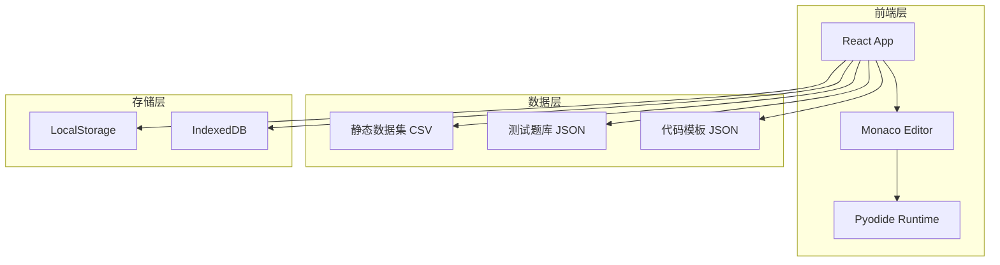
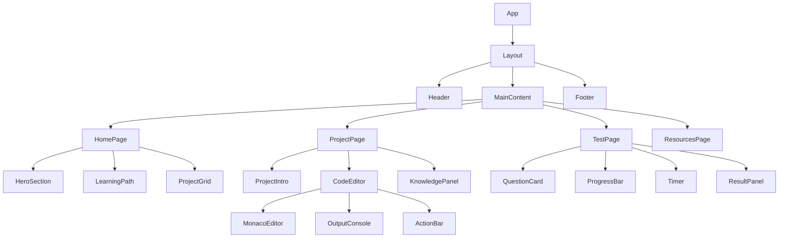

# 数据分析实战训练营 - 技术架构文档

## 1. 架构设计



## 2. 技术栈说明

- **前端框架**: React 18 + TypeScript
- **样式方案**: Tailwind CSS 3
- **构建工具**: Vite
- **代码编辑器**: Monaco Editor (浏览器版)
- **Python运行时**: Pyodide (浏览器中运行Python)
- **状态管理**: React Context + useReducer
- **数据持久化**: LocalStorage + IndexedDB

## 3. 路由定义

| 路由 | 页面 | 说明 |
|------|------|------|
| `/` | 首页 | 课程介绍、学习路径、项目列表 |
| `/project/:id` | 项目详情页 | 项目介绍、代码练习、知识点 |
| `/project/:id/test` | 测试页面 | 10道测试题、计时、成绩 |
| `/project/:id/result` | 测试结果页 | 成绩展示、答案解析 |
| `/resources` | 学习资源页 | 数据集、代码模板、文档 |

## 4. 数据模型

### 4.1 项目数据模型

```typescript
interface Project {
  id: number;
  title: string;
  description: string;
  coreSkills: string[];
  dataset: string;
  learningGoals: string[];
  codeTemplate: string;
  testQuestions: TestQuestion[];
}

interface TestQuestion {
  id: number;
  question: string;
  options: string[];
  correctAnswer: number;
  explanation: string;
  category: 'concept' | 'code' | 'application' | 'analysis';
}
```

### 4.2 用户进度模型

```typescript
interface UserProgress {
  projectId: number;
  codeCompleted: boolean;
  codeSubmission: string;
  testScore: number | null;
  testAnswers: number[];
  completedAt: string | null;
}
```

### 4.3 数据集模型

```typescript
interface Dataset {
  id: string;
  name: string;
  filename: string;
  fields: FieldDefinition[];
  description: string;
  useCases: string[];
}

interface FieldDefinition {
  name: string;
  type: string;
  description: string;
}
```

## 5. 组件架构



## 6. 核心功能实现

### 6.1 代码编辑器

- 使用 Monaco Editor 作为代码编辑器
- 集成 Pyodide 实现浏览器端 Python 执行
- 提供代码模板一键填充功能
- 支持代码保存和加载

### 6.2 测试系统

- 每个项目10道单选题
- 实时显示答题进度
- 计时功能（可选）
- 提交后显示成绩和解析
- 错题标记和复习功能

### 6.3 进度追踪

- 使用 LocalStorage 存储用户进度
- 首页显示总体学习进度
- 项目卡片显示完成状态

## 7. 文件结构

```
src/
├── components/
│   ├── common/
│   │   ├── Header.tsx
│   │   ├── Footer.tsx
│   │   ├── Card.tsx
│   │   └── Button.tsx
│   ├── home/
│   │   ├── HeroSection.tsx
│   │   ├── LearningPath.tsx
│   │   └── ProjectGrid.tsx
│   ├── project/
│   │   ├── ProjectIntro.tsx
│   │   ├── CodeEditor.tsx
│   │   ├── OutputConsole.tsx
│   │   └── KnowledgePanel.tsx
│   ├── test/
│   │   ├── QuestionCard.tsx
│   │   ├── ProgressBar.tsx
│   │   ├── Timer.tsx
│   │   └── ResultPanel.tsx
│   └── resources/
│       ├── DatasetCard.tsx
│       ├── CodeTemplate.tsx
│       └── KnowledgeDoc.tsx
├── pages/
│   ├── Home.tsx
│   ├── Project.tsx
│   ├── Test.tsx
│   ├── Result.tsx
│   └── Resources.tsx
├── data/
│   ├── projects.json
│   ├── questions/
│   │   ├── project01.json
│   │   ├── project02.json
│   │   └── ...
│   └── datasets/
│       ├── retail_orders.csv
│       ├── market_basket.csv
│       ├── user_logs.csv
│       └── ab_test.csv
├── hooks/
│   ├── usePyodide.ts
│   ├── useProgress.ts
│   └── useTimer.ts
├── context/
│   └── AppContext.tsx
├── types/
│   └── index.ts
├── utils/
│   ├── storage.ts
│   └── codeRunner.ts
├── App.tsx
├── main.tsx
└── index.css
```

## 8. 性能优化

- 代码编辑器懒加载
- Pyodide 异步加载，显示加载进度
- 数据集按需加载
- 使用 React.memo 优化组件渲染
- 虚拟列表优化长列表渲染

## 9. 兼容性要求

- 现代浏览器：Chrome 90+, Firefox 88+, Safari 14+, Edge 90+
- 需要支持 WebAssembly（Pyodide 依赖）
- 响应式设计支持 375px - 1920px 宽度
